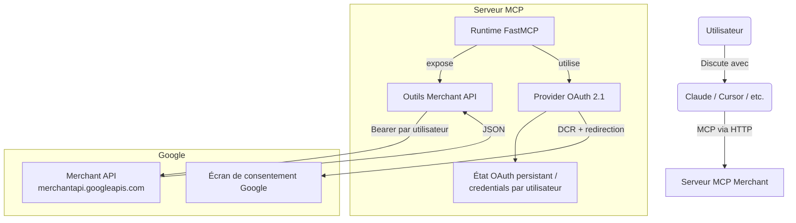

# Google Merchant Center MCP

> 🇬🇧 An English version is available: **[README.md](./README.md)**

Un serveur [Model Context Protocol](https://modelcontextprotocol.io) qui expose
la [Google Merchant API](https://developers.google.com/merchant/api/reference/rest)
à Claude, Cursor et tout autre client compatible MCP.

Le serveur est **multi-utilisateur par défaut** : chaque utilisateur se
connecte avec son propre compte Google via OAuth 2.1, et les identifiants
sont stockés sur disque par utilisateur. Deux analystes qui interrogent le
même serveur ne voient strictement que leurs propres comptes Merchant Center.

Conçu et maintenu par **[Webloom](https://webloom.fr)** — agence de
search-marketing à Paris spécialisée en SEO, SEA et Google Shopping. Nous
l'utilisons quotidiennement pour brancher Merchant Center à nos workflows
LLM ; nous l'avons publié en open source pour que vous puissiez en faire
autant.

> **À noter — Merchant API v1 (post-février 2026) :** ce serveur cible la
> version **v1 stable** de chaque sous-API Merchant (Accounts, Products,
> Reports, DataSources, IssueResolution, Promotions, Quota, Inventories,
> Notifications, Conversions). Google a
> [retiré v1beta le 28 février 2026](https://developers.google.com/merchant/api/guides/compatibility/migrate-v1beta-v1)
> et le langage de requête Reports a changé : **noms de tables snake_case**
> et **noms de champs sans préfixe** (plus de `segments.` / `metrics.`).
> Tous les rapports prêts à l'emploi (`get_top_products`,
> `get_price_competitiveness`, `get_best_sellers`) utilisent déjà la nouvelle
> syntaxe. Voir [§7 Migration depuis v1beta](#7bis--migration-depuis-v1beta)
> ci-dessous si vous avez vos propres requêtes à porter.

> **Étape unique — `registerGcp` :** Google exige désormais que chaque
> projet GCP utilisé pour appeler la Merchant API soit enregistré **une
> fois** via la méthode `accounts.developerRegistration.registerGcp`, en
> fournissant un email de contact développeur. Tant que ce n'est pas
> fait, tout appel v1 depuis ce projet renvoie `401 UNAUTHENTICATED`
> avec le message *« GCP project … is not registered with the merchant
> account »*. Le serveur fournit un outil `register_gcp_developer` plus
> trois recettes alternatives (curl, Python, outil MCP) pour
> l'enregistrement — voir [§1.5](#15-enregistrement-unique-du-projet-gcp-avec-merchant-center).

---

## Points clés

- **24 outils** (23 en lecture + l'appel unique `register_gcp_developer`
  pour le setup) couvrant comptes, sous-comptes, produits, flux
  de données, promotions, quotas, rendu localisé des problèmes, le DSL
  complet de Merchant Reports (l'équivalent du GAQL côté Ads) et plusieurs
  rapports prêts à l'emploi.
- **OAuth 2.1 avec Dynamic Client Registration** — fonctionne tel quel
  avec Claude Desktop / Claude.ai, Cursor et n'importe quel client MCP
  standard. Le serveur émet ses propres jetons MCP ; les identifiants
  Google ne quittent jamais le serveur.
- **Isolation par utilisateur** — chaque identité authentifiée a son propre
  fichier de credentials sous `GOOGLE_MCP_CREDENTIALS_DIR`. Caches et état
  OAuth sont indexés par adresse e-mail.
- **Lecture seule par défaut** — tout appel d'écriture qui n'est ni
  `:search` ni `:render*` est bloqué tant que vous ne mettez pas
  explicitement `GOOGLE_MERCHANT_READ_ONLY=0`.
- **Indépendant de l'hébergeur** — toute plateforme capable d'exécuter une
  application Python ASGI avec un répertoire persistant convient (Render,
  Fly.io, Railway, Heroku, AWS, GCP, bare metal, Docker, Kubernetes…).

---

## Ce que vous pouvez lui demander

| Outil | Rôle |
|---|---|
| `list_accounts` | Liste tous les comptes Merchant Center accessibles à l'utilisateur authentifié |
| `find_accounts(query)` | Recherche floue de comptes par **nom de marque, domaine ou ID partiel** — répondez à « quel est l'ID Merchant Center de `webloom.fr` ? » sans connaissance préalable |
| `list_subaccounts(account_id)` | Liste les sous-comptes d'un compte avancé (provider) |
| `get_account(account_id)` | Récupère un compte Merchant Center |
| `list_users(account_id)` | Liste les utilisateurs ayant accès à un compte |
| `list_programs(account_id)` | Liste les programmes (Free Listings, Shopping Ads…) actifs |
| `list_regions(account_id)` | Liste les régions de livraison configurées |
| `get_shipping_settings(account_id)` | Services de livraison + groupes de tarifs |
| `get_business_info(account_id)` | Adresse, téléphone, contacts service client |
| `list_products(account_id)` | Une page de produits du compte |
| `get_product(account_id, product_name)` | Récupère un produit par son resource name |
| `list_data_sources(account_id)` | Liste des flux / sources de données |
| `get_data_source(account_id, data_source_id)` | Récupère une source de données |
| `list_file_uploads(account_id, data_source_id)` | Statut du dernier upload pour une source |
| `aggregate_product_statuses(account_id)` | Synthèse des produits approuvés / en attente / refusés |
| `render_account_issues(account_id)` | Problèmes du compte (rendus localisés) |
| `render_product_issues(account_id, product_name)` | Problèmes d'un produit (rendus localisés) |
| `run_merchant_query(account_id, query)` | Lance une requête Merchant Reports arbitraire |
| `get_top_products(account_id, days)` | Rapport « top produits » prêt à l'emploi |
| `get_price_competitiveness(account_id)` | Rapport de benchmark prix vs. concurrents |
| `get_best_sellers(account_id, country)` | Rapport best-sellers par pays |
| `list_promotions(account_id)` | Liste des promotions configurées |
| `get_promotion(account_id, promotion_name)` | Récupère une promotion |
| `list_quotas(account_id)` | Quotas API utilisés / restants par groupe de méthodes |
| `register_gcp_developer(account_id, developer_email)` | Setup unique `registerGcp` exigé par la Merchant API v1 GA — voir [§1.5](#15-enregistrement-unique-du-projet-gcp-avec-merchant-center) |

S'y ajoutent une ressource MCP `merchant-reports://reference` et deux prompts
(`google_merchant_workflow`, `merchant_reports_help`).

---

## Architecture



Déroulé d'une première connexion :

1. Le client interroge `/.well-known/oauth-protected-resource` et découvre
   le serveur d'autorisation.
2. Le client effectue un **Dynamic Client Registration** sur `/register`.
3. L'utilisateur passe par l'écran de consentement Google pour le scope
   `https://www.googleapis.com/auth/content`.
4. Google redirige vers `/oauth2callback`, qui émet un couple
   access + refresh MCP et stocke les credentials Google de l'utilisateur.
5. Tous les appels `/mcp` suivants s'authentifient avec le jeton MCP ; le
   serveur retrouve les credentials Google en interne.

---

## 1. Configuration Google Cloud Console (une fois)

1. **Activez la Merchant API** : *APIs & Services → Library → "Merchant API"
   → Enable*.
2. **Écran de consentement OAuth** :
   - Type d'utilisateur : External (ou Internal pour Workspace seulement).
   - Ajoutez le scope `https://www.googleapis.com/auth/content`.
   - Ajoutez votre adresse comme test user.
   - Soumettez à la vérification avant d'aller en production (Google exige
     une vérification pour `auth/content` ; comptez 3-5 jours ouvrés).
3. **Créez un Client ID OAuth 2.0** (type : Web application) :
   - URIs de redirection autorisées :
     - `http://localhost:8000/oauth2callback` (dev local)
     - `https://<votre-host-public>/oauth2callback` (production)
   - Conservez le **Client ID** et le **Client Secret**.
4. **Accès Merchant Center** : le compte Google qui s'authentifie doit déjà
   avoir accès aux comptes Merchant Center cibles (compte avancé ou
   sous-comptes). L'accès tiers se gère sur <https://merchants.google.com/>.

> La Merchant API n'accepte que des **credentials utilisateur OAuth**. Pas
> de `developer-token`, et les comptes de service ne fonctionnent qu'en
> impersonation d'un utilisateur Merchant Center (rarement utile) — restez
> sur OAuth.

---

## 1.5. Enregistrement unique du projet GCP avec Merchant Center

Depuis le passage en v1 de la Merchant API (février 2026), chaque projet
Google Cloud qui appelle l'API doit être **enregistré une fois** auprès
d'un compte Merchant Center. Tant que ce n'est pas fait, chaque appel v1
renvoie :

```
401 UNAUTHENTICATED
GCP project with id <PROJECT_ID> and number <PROJECT_NUMBER> is not registered with the merchant account.
```

C'est une opération unique par projet GCP. L'enregistrement est global —
une fois le projet enregistré, vos utilisateurs OAuth peuvent appeler
l'API pour **n'importe quel compte Merchant Center sur lequel ils sont
Admin**, pas seulement celui utilisé pour l'enregistrement. (Voir le
[guide officiel](https://developers.google.com/merchant/api/guides/quickstart/registration)
pour le contexte complet.)

### 1.5.a — Prérequis

1. **Merchant API activée** sur votre projet GCP :
   <https://console.cloud.google.com/apis/library/merchantapi.googleapis.com>
   → sélectionnez votre projet → cliquez **Activer**.
2. **Rôle Admin** sur le compte Merchant Center cible, pour le compte
   Google dont les credentials OAuth émettront l'appel d'enregistrement.
   Vérifiez dans *Merchant Center → Paramètres → Personnes et accès*.
3. **Une vraie adresse Google** (pas un compte de service) à enregistrer
   comme contact technique développeur. Google enverra à cette adresse
   les annonces de breaking changes et de fin de support.

### 1.5.b — Choisir le bon compte Merchant Center pour l'enregistrement

L'enregistrement est stocké dans **un** Merchant Center, mais il
autorise le **projet GCP de manière globale** — ce choix affecte donc
surtout l'endroit où le contact développeur apparaît, pas ce que vous
pouvez appeler.

Par ordre de préférence :

1. **Votre compte avancé (MCA / multi-comptes) d'organisation** si vous
   en avez un. Les sous-comptes sont implicitement couverts, et le
   contact développeur reste chez vous.
2. **Tout compte Merchant Center indépendant que vous possédez** (par
   exemple un compte créé pour le flux produit de votre propre
   entreprise, même vide). Plus propre pour les marchands solo et les
   petites agences.
3. **En dernier recours — un compte client / partenaire où vous êtes
   Admin**. Fonctionne quand même pour *tous* les autres clients que
   vous administrez ensuite, mais le contact développeur sera créé
   dans ce compte client (préoccupation cosmétique uniquement).

> **Note pour les agences / 3P** : Google recommande explicitement de
> faire l'enregistrement contre votre compte Merchant Center *primaire*
> uniquement — pas contre chaque sous-compte client. Un seul
> enregistrement couvre tous les sous-comptes liés, et l'autorisation au
> niveau GCP couvre tous les autres comptes clients que vous pouvez
> administrer via OAuth. Voir les
> [recommandations officielles pour les 3P](https://developers.google.com/merchant/api/guides/quickstart/registration#important-considerations).

### 1.5.c — Lancer l'enregistrement (au choix)

#### Option A — outil MCP intégré (recommandé une fois le serveur déployé)

Ce serveur expose un outil `register_gcp_developer`. Une fois que
[§2 Développement local](#2-développement-local) ou
[§3 Déploiement](#3-déploiement-sur-votre-host-favori) est en place :

1. Mettez temporairement `GOOGLE_MERCHANT_READ_ONLY=0` (l'enregistrement
   est un appel en écriture) puis redéployez / redémarrez.
2. Depuis votre client MCP, demandez :
   > *« Utilise le MCP Google Merchant. Appelle `register_gcp_developer`
   > avec `account_id="<ID MC numérique>"` et
   > `developer_email="<votre.vraie.adresse@example.com>"`. »*
3. Vous devriez recevoir un objet `DeveloperRegistration` en réponse.
4. Remettez `GOOGLE_MERCHANT_READ_ONLY=1` puis redéployez / redémarrez.

#### Option B — `curl` depuis votre machine (sans serveur déployé)

Récupérez un access token court via gcloud (vous devez être connecté
en tant qu'Admin Merchant Center) :

```bash
gcloud auth application-default login \
  --scopes=https://www.googleapis.com/auth/content,openid,email

ACCESS_TOKEN=$(gcloud auth application-default print-access-token)
ACCOUNT_ID="<ID MC numérique>"
DEVELOPER_EMAIL="<votre.vraie.adresse@example.com>"

curl -X POST \
  "https://merchantapi.googleapis.com/accounts/v1/accounts/${ACCOUNT_ID}/developerRegistration:registerGcp" \
  -H "Authorization: Bearer ${ACCESS_TOKEN}" \
  -H "Content-Type: application/json" \
  -d "{\"developerEmail\": \"${DEVELOPER_EMAIL}\"}"
```

#### Option C — script Python autonome (utilise un refresh token existant)

```python
import os, requests
from google.oauth2.credentials import Credentials
from google.auth.transport.requests import Request

ACCOUNT_ID = "<ID MC numérique>"
DEVELOPER_EMAIL = "<votre.vraie.adresse@example.com>"

creds = Credentials(
    token=None,
    refresh_token=os.environ["GOOGLE_MERCHANT_REFRESH_TOKEN"],
    client_id=os.environ["GOOGLE_OAUTH_CLIENT_ID"],
    client_secret=os.environ["GOOGLE_OAUTH_CLIENT_SECRET"],
    token_uri="https://oauth2.googleapis.com/token",
    scopes=["https://www.googleapis.com/auth/content"],
)
creds.refresh(Request())

resp = requests.post(
    f"https://merchantapi.googleapis.com/accounts/v1/accounts/{ACCOUNT_ID}"
    f"/developerRegistration:registerGcp",
    headers={
        "Authorization": f"Bearer {creds.token}",
        "Content-Type": "application/json",
    },
    json={"developerEmail": DEVELOPER_EMAIL},
    timeout=30,
)
print(resp.status_code, resp.text)
```

### 1.5.d — Après un enregistrement réussi

Attendez **~5 minutes** (les docs Google précisent que la propagation
n'est pas instantanée), puis retentez n'importe quel endpoint v1. À
partir de là, toutes les requêtes depuis ce projet GCP sont autorisées.

Si vous avez fourni un `developer_email` qui n'est *pas* déjà un
utilisateur Merchant Center, le destinataire reçoit une invitation et
**doit l'accepter dans les 14 jours**, sans quoi l'enregistrement
expire et il faut tout recommencer. Les utilisateurs MC existants sont
auto-promus au rôle `API_DEVELOPER` sans étape d'acceptation.

### 1.5.e — Erreurs courantes

| Statut | Extrait | Signification / correction |
|---|---|---|
| `200 OK` | `{"name": "accounts/.../developerRegistration", "gcpIds": [...]}` | ✅ Terminé. Attendez ~5 min, puis appelez n'importe quel endpoint v1. |
| `400 INVALID_ARGUMENT` | `developerEmail` invalide | Email mal formé ou adresse de compte de service. Utilisez une vraie adresse Google. |
| `403 PERMISSION_DENIED` | "user does not have admin access" | L'identité OAuth n'est pas Admin sur le MC cible. Ajoutez Admin dans MC → Paramètres → Personnes et accès. |
| `404 NOT_FOUND` | "Merchant API not enabled" | Vous avez sauté le prérequis #1. Activez la Merchant API dans la Cloud Console pour ce projet. |
| `409 ALREADY_EXISTS` / `ALREADY_REGISTERED` (même MC) | "already registered" | ✅ Bonne nouvelle — votre projet était déjà configuré. Rien à faire. |
| `409 ALREADY_REGISTERED` (autre MC) | "registered with another Merchant Center" | Un projet GCP ne peut être lié qu'à un seul MC à la fois. Soit utilisez un autre projet GCP, soit appelez `unregisterGcp` sur l'ancien MC. |
| Toujours 401 après 10+ min | Cas limite de propagation | Redémarrez votre serveur une fois pour forcer un refresh de token, puis retentez. |

---

## 2. Développement local

```bash
git clone https://github.com/<vous>/merchant-center-mcp.git
cd merchant-center-mcp
python3.11 -m venv .venv
source .venv/bin/activate
pip install -r requirements.txt
cp .env.example .env
# Renseignez GOOGLE_OAUTH_CLIENT_ID / SECRET et
#   GOOGLE_OAUTH_REDIRECT_URI=http://localhost:8000/oauth2callback
python merchant_server.py
```

Vérifiez les métadonnées OAuth :

```bash
curl http://localhost:8000/.well-known/oauth-authorization-server | jq
curl http://localhost:8000/.well-known/oauth-protected-resource | jq
```

`scopes_supported` doit contenir `https://www.googleapis.com/auth/content`
et **pas** `https://www.googleapis.com/auth/adwords`.

Pour tester le flux complet, déclarez le serveur dans Cursor ou Claude
Desktop (cf. §4) et laissez le client gérer le DCR.

---

## 3. Déploiement sur n'importe quel hébergeur

Le serveur est une application Python ASGI standard :

- **Entrypoint :** `merchant_server:app`
- **Serveur ASGI :** `uvicorn` (déjà dans `requirements.txt`)
- **Runtime requis :** Python 3.11+
- **Variables d'environnement requises :** voir §6
- **Disque requis :** un répertoire inscriptible pour
  `GOOGLE_MCP_CREDENTIALS_DIR`, qui survit aux redéploiements (les jetons
  OAuth par utilisateur, le registre des clients DCR et l'état de login en
  cours y vivent). Sans ça, chaque redéploiement déconnecte tous vos
  utilisateurs et les callbacks mid-login échouent.

Commande de lancement générique :

```bash
uvicorn merchant_server:app --host 0.0.0.0 --port "${PORT:-8000}"
```

Quelques recettes pour les hébergeurs courants. Aucune n'est obligatoire —
choisissez ce qui colle à votre stack.

### 3.a — Render (web service + disque persistant)

| Champ | Valeur |
|---|---|
| Runtime | Python 3.11 |
| Build Command | `pip install -r requirements.txt` |
| Start Command | `uvicorn merchant_server:app --host 0.0.0.0 --port $PORT` |
| Health Check Path | `/.well-known/oauth-protected-resource` |
| Persistent Disk | mount path `/data`, taille `1 GB` |
| `GOOGLE_MCP_CREDENTIALS_DIR` | `/data/credentials` |

Un `render.yaml` déclaratif est inclus dans le repo.

> **Restez sur une seule instance.** L'état OAuth Google (`state`) et les
> codes d'auth MCP éphémères sont persistés sous
> `GOOGLE_MCP_CREDENTIALS_DIR`, donc un **redémarrage en cours de login**
> ne casse plus le callback. Les écritures utilisent un verrou
> inter-processus + merge-before-write pour éviter qu'un worker n'écrase
> le login en cours d'un autre (last-writer-wins). Ce disque reste
> mono-instance sur Render : si vous scalez sans sticky sessions (ou store
> Redis/DB partagé), authorize et `/oauth2callback` peuvent atterrir sur
> des process différents → `Unknown state` / `/token` 401. Les utilisateurs
> déjà connectés (refresh token) ne sont pas touchés. Gardez **1 instance**,
> activez les sticky sessions, ou partagez l'état OAuth entre instances.

### 3.b — Fly.io

```bash
fly launch --no-deploy --copy-config
fly volumes create data --size 1 --region cdg     # même région que l'app
# Dans fly.toml, ajoutez :
#   [[mounts]]
#     source = "data"
#     destination = "/data"
fly secrets set MCP_ENABLE_OAUTH21=true \
                GOOGLE_OAUTH_CLIENT_ID=... \
                GOOGLE_OAUTH_CLIENT_SECRET=... \
                GOOGLE_OAUTH_REDIRECT_URI=https://<app>.fly.dev/oauth2callback \
                MERCHANT_MCP_EXTERNAL_URL=https://<app>.fly.dev \
                GOOGLE_MCP_CREDENTIALS_DIR=/data/credentials
fly deploy
```

### 3.c — Railway

Start command :
`uvicorn merchant_server:app --host 0.0.0.0 --port $PORT`. Attachez un
Volume monté sur `/data` et configurez les variables de §6.

### 3.d — Docker (VPS, ECS, GKE, AKS, Cloud Run, Fly machines, etc.)

Le repo n'embarque pas de Dockerfile pour rester neutre, mais ce fichier
de 8 lignes suffit :

```dockerfile
FROM python:3.11-slim
WORKDIR /app
COPY requirements.txt .
RUN pip install --no-cache-dir -r requirements.txt
COPY . .
ENV GOOGLE_MCP_CREDENTIALS_DIR=/data/credentials
EXPOSE 8000
CMD ["sh", "-c", "uvicorn merchant_server:app --host 0.0.0.0 --port ${PORT:-8000}"]
```

Montez un volume sur `/data` (Docker volume nommé, EBS, GCE PD, EFS, PVC
Kubernetes — au choix) et déclarez les variables de §6.

### 3.e — Bare metal / systemd

Clonez le repo sur votre serveur, installez avec `pip`, lancez via
`systemd` ou `supervisord`, mettez nginx/Caddy/Traefik devant, et pointez
`GOOGLE_MCP_CREDENTIALS_DIR` vers n'importe quel dossier local que vous
sauvegardez.

### 3.f — Limitation serverless (Vercel, AWS Lambda…)

Le flux OAuth stocke les credentials et clients DCR sur disque pour que les
redémarrages ne fassent pas perdre les sessions. **Les plateformes serverless
sans état ne collent pas à ce modèle nativement.** Si vous devez tourner sur
Vercel / Lambda / Cloud Functions, branchez un `CredentialStore` externe
(voir `auth/credential_store.py` — c'est une `ABC`) adossé à Redis, Postgres,
DynamoDB, S3, etc. Pas fourni ici, mais ~50 lignes de code.

### 3.g — Mettez à jour le client OAuth Google

Quel que soit l'hébergeur, ajoutez son URL publique aux **Authorized
redirect URIs** du client OAuth :

```
https://<votre-host-public>/oauth2callback
```

Sans ça, Google rejette le redirect au moment du consentement avec
`redirect_uri_mismatch`.

---

## 4. Branchement aux clients MCP

Quand `MCP_ENABLE_OAUTH21=true`, le client effectue un Dynamic Client
Registration sur le `registration_endpoint` du serveur, redirige l'utilisateur
vers Google pour le consentement, puis stocke le jeton MCP émis. Les
credentials Google ne quittent jamais le serveur. Aucun secret n'est requis
côté client.

### 4.a — Claude Desktop

Éditez le fichier de config Claude (créez-le s'il n'existe pas) :

| OS | Chemin |
|---|---|
| macOS | `~/Library/Application Support/Claude/claude_desktop_config.json` |
| Windows | `%APPDATA%\Claude\claude_desktop_config.json` |
| Linux | `~/.config/Claude/claude_desktop_config.json` |

Ajoutez l'entrée `googleMerchant` :

```json
{
  "mcpServers": {
    "googleMerchant": {
      "type": "http",
      "url": "https://<votre-host-public>/mcp"
    }
  }
}
```

Redémarrez Claude Desktop, ouvrez une nouvelle conversation : à la première
question liée à Merchant Center, Claude affiche la fenêtre OAuth Google.
Connectez-vous avec le compte Google qui possède (ou a accès à) votre
Merchant Center.

### 4.b — Claude.ai (web) — connecteur MCP custom

Paramètres → **Connecteurs** → **Ajouter un connecteur custom** →

- **Nom :** `Google Merchant`
- **URL du serveur MCP distant :** `https://<votre-host-public>/mcp`

Sauvegardez. Claude.ai vous guide à travers le flux OAuth lors de la
première utilisation.

### 4.c — Cursor

Cursor lit soit une config locale au projet (`.cursor/mcp.json`), soit
votre config utilisateur (`~/.cursor/mcp.json`).

```json
{
  "mcpServers": {
    "googleMerchant": {
      "type": "http",
      "url": "https://<votre-host-public>/mcp"
    }
  }
}
```

Ensuite : Cursor Settings → **MCP** → activez `googleMerchant`. Le bouton
"Connect" déclenche le flux OAuth.

### 4.d — Autres clients MCP (apps custom, OpenAI Apps SDK, etc.)

Tout client supportant le transport MCP **Streamable HTTP** avec
autorisation OAuth 2.1 fonctionne de la même façon — pointez-le sur
`https://<votre-host-public>/mcp`. La découverte se fait via
`/.well-known/oauth-protected-resource` et le Dynamic Client Registration
sur le `registration_endpoint`.

### 4.e — Une fois connecté : que demander ?

Essayez ces prompts (aucun setup additionnel après l'auth) :

- *« Trouve le compte Merchant Center pour webloom.fr »* → appelle
  `find_accounts(query="webloom.fr")` et renvoie l'ID correspondant.
- *« Liste mes comptes Merchant Center »* → `list_accounts`.
- *« Combien de produits sont en attente ou refusés sur le compte
  123456789 ? »* → `aggregate_product_statuses`.
- *« Montre-moi les 20 meilleurs produits par clics sur les 30 derniers
  jours pour le compte 123456789 »* → `get_top_products`.
- *« Affiche les problèmes au niveau du compte 123456789 en français »* →
  `render_account_issues(language_code="fr")`.
- *« Exécute cette requête Merchant Reports sur le compte 123456789 :
  SELECT offer_id, clicks, impressions FROM product_performance_view WHERE
  date BETWEEN '2026-04-01' AND '2026-04-30' ORDER BY clicks DESC
  LIMIT 20 »* (notez la syntaxe v1 : nom de table snake_case, pas de
  qualificatifs `segments.`/`metrics.`) →
  `run_merchant_query`.
- *« Compare les benchmarks de prix vs concurrents aux US pour le compte
  123456789 »* → `get_price_competitiveness`.
- *« Quelles promotions sont actives sur le compte 123456789 ? »* →
  `list_promotions`.

Si vous avez défini `DEFAULT_MERCHANT_ACCOUNT_ID` côté serveur, vous
pouvez omettre l'ID dans tous les prompts ci-dessus.

### 4.f — Stdio local (dev mono-utilisateur)

Pour un setup dev mono-utilisateur, headless (sans flux OAuth), pointez
le client directement sur le script :

```json
{
  "mcpServers": {
    "googleMerchant": {
      "command": "/abs/chemin/.venv/bin/python",
      "args": ["/abs/chemin/merchant_server.py"],
      "env": {
        "MCP_ENABLE_OAUTH21": "false",
        "GOOGLE_MERCHANT_AUTH_TYPE": "oauth",
        "GOOGLE_OAUTH_CLIENT_ID": "...",
        "GOOGLE_OAUTH_CLIENT_SECRET": "...",
        "GOOGLE_MERCHANT_REFRESH_TOKEN": "...",
        "GOOGLE_MERCHANT_READ_ONLY": "1"
      }
    }
  }
}
```

Générez une fois un refresh token via `InstalledAppFlow` (ou tout autre
helper OAuth out-of-band) pour que les exécutions suivantes soient
headless.

---

## 5. Checklist de validation

- [ ] `pip install -r requirements.txt` propre
- [ ] `python merchant_server.py` démarre sans exception en local
- [ ] `GET /.well-known/oauth-authorization-server` renvoie les métadonnées RFC 8414
- [ ] `GET /.well-known/oauth-protected-resource` renvoie les métadonnées de la ressource pointant sur la même base URL
- [ ] Le `registration_endpoint` accepte `POST` avec un body JSON vide et renvoie un client enregistré (par défaut `<base>/register`)
- [ ] Le DCR + auth flow depuis Cursor amène sur l'écran Google n'affichant **que** les scopes `auth/content` + `openid email profile` (pas d'`adwords`)
- [ ] Après consentement, `list_accounts` renvoie les comptes Merchant Center de l'utilisateur
- [ ] `run_merchant_query(account_id, "SELECT product_view.id, product_view.title FROM productView LIMIT 5")` renvoie des lignes
- [ ] Un redémarrage **en cours de login** laisse quand même l'OAuth aboutir (`state` Google restauré depuis `server_state.json`)
- [ ] Un redémarrage du serveur **ne force pas** la reconnexion des utilisateurs déjà connectés (vérifier `<credentials_dir>/mcp_oauth/server_state.json`)
- [ ] Un appel à un (futur) outil d'écriture avec `GOOGLE_MERCHANT_READ_ONLY=1` lève `PermissionError`
- [ ] Deux comptes Google différents qui interrogent le même serveur voient des `list_accounts` différents

---

## 6. Variables d'environnement

Voir `.env.example` pour la liste complète et les commentaires inline. Les
plus importantes :

| Variable | Rôle |
|---|---|
| `MCP_ENABLE_OAUTH21` | `true` pour activer le flux OAuth 2.1 multi-utilisateur |
| `GOOGLE_OAUTH_CLIENT_ID` / `GOOGLE_OAUTH_CLIENT_SECRET` | Le client OAuth Google Cloud utilisé pour parler à Google |
| `GOOGLE_OAUTH_REDIRECT_URI` | L'URI de redirection enregistrée chez Google (`<base>/oauth2callback`) |
| `MERCHANT_MCP_EXTERNAL_URL` | URL publique du serveur (utilisée derrière les reverse proxies) |
| `GOOGLE_MCP_CREDENTIALS_DIR` | Répertoire des fichiers JSON de credentials par utilisateur (doit être persistant) |
| `MCP_OAUTH_STATE_PERSIST` | `true` pour persister les clients DCR, l'état OAuth Google en cours, les codes d'auth MCP et les jetons MCP entre redémarrages |
| `MCP_ACCESS_TOKEN_TTL_SECONDS` | TTL des access tokens MCP (défaut 3600) |
| `MCP_REFRESH_TOKEN_TTL_SECONDS` | TTL des refresh tokens MCP (défaut 30 jours) |
| `GOOGLE_MERCHANT_READ_ONLY` | `1` (défaut) bloque tout appel non `:search` / non `:render*` |
| `DEFAULT_MERCHANT_ACCOUNT_ID` | Compte par défaut, pour omettre `account_id` dans les appels |
| `MCP_HTTP_PATH` | Chemin du transport HTTP streamable (défaut `/mcp`) |
| `MCP_CORS_ORIGINS` | Allow-list CORS séparée par virgules. Vide / non défini = `*` |
| `MERCHANT_HTTP_TIMEOUT_SECONDS` | Timeout sortant pour les appels Merchant API (défaut 30) |
| `MCP_BEARER_TOKEN` | Garde-fou transport mono-secret, **uniquement** quand OAuth 2.1 est désactivé |

Vous pouvez aussi figer la version d'une sous-API (par ex. la passer en
`v1`) via :

```
MERCHANT_ACCOUNTS_API_VERSION
MERCHANT_PRODUCTS_API_VERSION
MERCHANT_DATASOURCES_API_VERSION
MERCHANT_ISSUERESOLUTION_API_VERSION
MERCHANT_REPORTS_API_VERSION
MERCHANT_PROMOTIONS_API_VERSION
MERCHANT_QUOTA_API_VERSION
```

---

## 7. DSL Merchant Reports (MCQL v1)

La sous-API Reports parle le **Merchant Center Query Language (MCQL)**, un
DSL SQL-like conceptuellement proche du GAQL côté Ads. La **syntaxe v1**
(post-février 2026) utilise des **noms de tables en snake_case** et des
**noms de champs sans préfixe** — les qualificatifs (`segments.` /
`metrics.`) ne sont plus acceptés.

Vues principales (à utiliser telles quelles dans le `FROM`) :

- `product_performance_view` – clics / impressions / conversions par produit
- `non_product_performance_view` – performance non attribuable à un produit
- `product_view` – snapshot du catalogue (titre, marque, prix, problèmes)
- `price_competitiveness_product_view` – benchmarks prix vs. concurrents
- `price_insights_product_view` – prix conseillé + uplift projeté
- `best_sellers_product_cluster_view` – clusters de produits best-sellers
- `best_sellers_brand_view` – marques best-sellers
- `competitive_visibility_competitor_view` – part d'impression vs. concurrents

Exemple rapide :

```sql
SELECT offer_id, clicks, impressions, click_through_rate
FROM product_performance_view
WHERE date BETWEEN '2026-04-01' AND '2026-04-30'
ORDER BY clicks DESC
LIMIT 50
```

Utilisez `run_merchant_query` pour les requêtes libres, ou les wrappers
(`get_top_products`, `get_price_competitiveness`, `get_best_sellers`) pour
les rapports courants. Le serveur expose aussi une ressource de référence
`merchant-reports://reference` et le prompt `merchant_reports_help`.

### 7.bis — Migration depuis v1beta

Si vous avez des requêtes v1beta, scripts MCC ou middleware à porter :

| v1beta | v1 |
|---|---|
| `productPerformanceView` (camelCase) | `product_performance_view` (snake_case) |
| `segments.offer_id`, `segments.date`, … | `offer_id`, `date`, … (sans `segments.`) |
| `metrics.clicks`, `metrics.impressions`, … | `clicks`, `impressions`, … (sans `metrics.`) |
| `metrics.conversion_value_micros` (int64 micros) | `conversion_value` (objet `Price`) |
| `Product.attributes` | `Product.productAttributes` |
| `Product.attributes.gtin` (string) | `Product.productAttributes.gtins` (array de strings) |
| `Product.attributes.taxes`, `Product.attributes.taxCategory` | **supprimés** |
| `Product.channel`, `ProductInput.channel`, `DataSource.channel` | **supprimés** — utiliser le booléen `legacyLocal` |
| `RegionalInventory.{price,salePrice,availability,…}` (top-level) | nichés sous `RegionalInventory.regionalInventoryAttributes` |
| `LocalInventory.{price,salePrice,availability,quantity,…}` | nichés sous `LocalInventory.localInventoryAttributes` |
| `RegionalInventory.customAttributes`, `LocalInventory.customAttributes` | **supprimés** |
| `availability`, `condition`, `gender` (strings) | maintenant des **enums** |
| `OnlineReturnPolicy.update` (PATCH) | **supprimé** — utiliser `OnlineReturnPolicy.create` |
| `CreateAndConfigureAccountRequest.users` (pluriel) | `CreateAndConfigureAccountRequest.user` (singulier) |
| Product/ProductInput `name` : encodage libre | Caractères spéciaux **doivent** être en base64url non-padded (RFC 4648 §5) |

Autres changements opérationnels :

- **`registerGcp` une fois par projet GCP** (voir l'encart en haut de
  ce README). Un 403 PERMISSION_DENIED au premier appel signifie
  généralement que cette étape manque.
- **`pageSize` Reports** par défaut à `1000`, plafonné en dur à `100 000`.
- **`pageToken`** : sémantique inchangée.
- Le scope OAuth (`https://www.googleapis.com/auth/content`) et l'hôte API
  (`merchantapi.googleapis.com`) sont inchangés.

Référence complète :
<https://developers.google.com/merchant/api/guides/compatibility/migrate-v1beta-v1>

---

## 8. Notes de sécurité

Le serveur hérite de la posture OAuth 2.1 du MCP, mais voici la synthèse
de la conception et les compromis à connaître.

**Ce que le serveur fait bien**

- **OAuth 2.1 avec PKCE (S256)** côté MCP ; PKCE est *obligatoire* quand
  `MCP_ENABLE_OAUTH21=true`.
- **Les jetons MCP sont émis par le serveur**, opaques, avec des TTL
  configurables (1 h access / 30 j refresh par défaut). Les refresh tokens
  sont rotés à chaque utilisation.
- **Les credentials Google ne quittent jamais le serveur.** Les clients MCP
  ne voient que le bearer MCP ; le serveur garde les access/refresh
  Google.
- **Isolation par utilisateur.** Credentials, caches et état OAuth sont
  indexés par l'e-mail Google vérifié ; un utilisateur ne peut jamais lire
  les données d'un autre.
- **Path-traversal bloqué dans le credential store.** Les noms de fichiers
  sont sanitisés et le chemin résolu doit rester sous le répertoire de
  base.
- **Vérification de l'e-mail.** Le claim `email_verified` du id_token
  Google doit valoir `true` pour que le serveur considère l'e-mail comme
  authoritative.
- **Lecture seule par défaut.** Les endpoints Merchant API mutants sont
  bloqués au niveau du wrapper HTTP tant que `GOOGLE_MERCHANT_READ_ONLY`
  n'est pas mis à `0`.
- **Timeout HTTP sortant** (`MERCHANT_HTTP_TIMEOUT_SECONDS`, défaut 30 s)
  empêche une connexion bloquée d'immobiliser un worker.
- **State signé.** Le paramètre `state` du redirect de consentement est
  généré avec `secrets.token_urlsafe(32)` et validé au callback (usage
  unique ; un replay renvoie `invalid_request`).

**Compromis à connaître**

- **Les jetons au repos sont du JSON non chiffré** sous
  `GOOGLE_MCP_CREDENTIALS_DIR`, en `0600`. Quiconque a accès au disque de
  l'hôte peut lire tous les jetons stockés. Traitez ce répertoire comme un
  coffre à secrets et sauvegardez-le en conséquence. Pour du chiffrement
  au repos, échangez `LocalDirectoryCredentialStore` contre une
  implémentation chiffrante (la classe abstraite est dans
  `auth/credential_store.py`).
- **La signature de l'id_token n'est volontairement pas vérifiée**
  pendant le callback Google, parce que le token vient directement de
  Google sur TLS dans la même requête — c'est un pattern OAuth
  server-side standard. Le chemin alternatif qui passe par le réseau
  (`GoogleRemoteAuthProvider`, utilisé seulement si vous l'activez)
  vérifie via le tokeninfo de Google et exige désormais
  `email_verified=true`.
- **CORS par défaut sur `*`** pour faciliter le premier branchement d'un
  client ; mettez `MCP_CORS_ORIGINS` en production pour restreindre.
- **La validation du Host est volontairement permissive** pour supporter
  les déploiements derrière reverse-proxy. L'authentification est faite à
  la couche OAuth ; n'exposez pas le serveur sans OAuth en production. Si
  vous y êtes contraint, mettez `MCP_BEARER_TOKEN` à une longue chaîne
  aléatoire comme garde-fou de transport.
- **Aucun rate-limit par IP n'est intégré.** Mettez le serveur derrière
  un CDN / WAF / reverse proxy capable de gérer l'abus si vous l'exposez
  publiquement.
- **Le DCR est ouvert** par défaut (n'importe quel client peut
  s'enregistrer). C'est by design pour MCP, mais ça veut dire que toute
  personne pouvant joindre le serveur peut lancer la danse OAuth.
  Combinez avec un réseau privé ou un secret transport si c'est un
  problème.
- **Le filtre lecture seule est heuristique**, pas exhaustif : il
  whiteliste `GET`, `:search`, `:render*`, `:listSubaccounts` et
  `:aggregateProductStatuses`. Auditer ce filtre avant d'ajouter des
  outils mutants.

Pour signaler une vulnérabilité : **security@webloom.fr**.

---

## 9. Références utiles

- Racine API : `https://merchantapi.googleapis.com`
- Index de référence : <https://developers.google.com/merchant/api/reference/rest>
- Méthode reports.search :
  <https://developers.google.com/merchant/api/reference/rest/reports_v1/accounts.reports>
- Guide des scopes / accès :
  <https://developers.google.com/merchant/api/guides/authorization/access-client-accounts>
- Vue d'ensemble du DSL Reports :
  <https://developers.google.com/merchant/api/guides/reports/overview>
- Model Context Protocol : <https://modelcontextprotocol.io>

---

## À propos de Webloom

Ce serveur MCP est conçu et maintenu par **[Webloom](https://webloom.fr)**,
agence de search-marketing à Paris. Nous concevons et pilotons des
campagnes SEO, SEA et Google Shopping pour des marques B2C et B2B
européennes, et nous développons l'outillage LLM (comme celui-ci) qui
nous permet de produire des analyses plus rapides et plus précises que
les tableurs des autres agences.

Si vous voulez de l'aide pour brancher ce serveur dans votre stack, tirer
plus de valeur de votre Merchant Center, ou faire développer un MCP
custom pour une autre API marketing, écrivez-nous via
<https://webloom.fr>.

---

## Licence

[MIT](./LICENSE).
