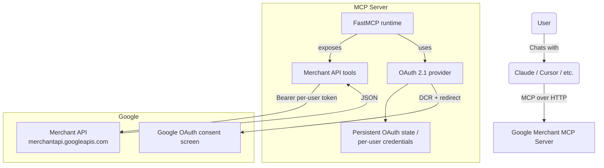

# Google Merchant Center MCP

> 🇫🇷 Une version française est disponible : **[README.fr.md](./README.fr.md)**

A [Model Context Protocol](https://modelcontextprotocol.io) server that exposes
the [Google Merchant API](https://developers.google.com/merchant/api/reference/rest)
to Claude, Cursor, and any other MCP-compatible client.

It is **multi-tenant by default**: each user signs in with their own Google
account through OAuth 2.1, and per-user credentials are stored on disk so two
analysts hitting the same server see strictly their own Merchant Center data.

Built and maintained by **[Webloom](https://webloom.fr)** — a search-marketing
agency in Paris specialized in SEO, SEA, and Google Shopping. We use it daily
to plug Merchant Center into our LLM workflows; we open-sourced it so you can
do the same.

> **Heads-up — Merchant API v1 (post-Feb 2026):** this server targets the
> **stable v1** surface of every Merchant sub-API (Accounts, Products, Reports,
> DataSources, IssueResolution, Promotions, Quota, Inventories, Notifications,
> Conversions). Google [discontinued v1beta on 2026-02-28](https://developers.google.com/merchant/api/guides/compatibility/migrate-v1beta-v1)
> and the Reports query language changed: **snake_case table names** and **bare
> field names** (no `segments.` / `metrics.` qualifiers). All built-in canned
> reports (`get_top_products`, `get_price_competitiveness`, `get_best_sellers`)
> already use the new syntax. See [§7 Migrating from v1beta](#7-migrating-from-v1beta)
> below if you have your own queries to port.

> **One-time setup — `registerGcp`:** Google now requires every GCP project
> used to call the Merchant API to be registered **once** via the
> `accounts.developerRegistration.registerGcp` method, providing a developer
> contact email. Until you do this, every v1 call from that project returns
> `401 UNAUTHENTICATED` with the message *"GCP project … is not registered
> with the merchant account"*. The server ships a `register_gcp_developer`
> tool plus three alternative recipes (curl, Python, MCP tool) for the
> registration — see [§1.5](#15-one-time-gcp-project-registration-with-merchant-center).

---

## Highlights

- **24 tools** (23 read-only + the one-time `register_gcp_developer` setup
  call) covering accounts, sub-accounts, products, data sources,
  promotions, quotas, item-issue rendering, the full Merchant Reports DSL
  (the equivalent of GAQL on the Ads side), and several canned report
  wrappers.
- **OAuth 2.1 with Dynamic Client Registration** — works out of the box with
  Claude Desktop / Claude.ai, Cursor, and any standard MCP client. The server
  mints its own MCP-issued tokens; users' Google credentials never leave the
  server.
- **Per-user isolation** — every authenticated identity gets its own
  credential file under `GOOGLE_MCP_CREDENTIALS_DIR`. Caches and OAuth state
  are keyed by email.
- **Read-only by default** — every non-`:search` / non-`:render*` write call
  is blocked unless you explicitly set `GOOGLE_MERCHANT_READ_ONLY=0`.
- **Hosting-agnostic** — anything that can run a Python ASGI app with a
  writable directory works (Render, Fly.io, Railway, Heroku, AWS, GCP,
  bare metal, Docker, Kubernetes, …).

---

## What you can ask it to do

| Tool | What it does |
|---|---|
| `list_accounts` | List every Merchant Center account the authenticated user can access |
| `find_accounts(query)` | Fuzzy-search accounts by **brand name, domain, or partial ID** — answer "what's the Merchant Center ID for `webloom.fr`?" without any prior knowledge |
| `list_subaccounts(account_id)` | List sub-accounts under an advanced (provider) account |
| `get_account(account_id)` | Fetch a single Merchant Center account |
| `list_users(account_id)` | List users with access to an account |
| `list_programs(account_id)` | List programs (Free Listings, Shopping Ads, …) on an account |
| `list_regions(account_id)` | List shipping regions configured for an account |
| `get_shipping_settings(account_id)` | Get shipping services + rate groups for an account |
| `get_business_info(account_id)` | Get the business address / customer-service contact |
| `list_products(account_id)` | One page of products in a Merchant Center account |
| `get_product(account_id, product_name)` | Fetch a single product by Merchant API resource name |
| `list_data_sources(account_id)` | List feeds / data sources |
| `get_data_source(account_id, data_source_id)` | Fetch one data source |
| `list_file_uploads(account_id, data_source_id)` | Show the latest upload status for a data source |
| `aggregate_product_statuses(account_id)` | Roll-up of approved / pending / disapproved counts |
| `render_account_issues(account_id)` | Localized account-level issues |
| `render_product_issues(account_id, product_name)` | Localized issues for one product |
| `run_merchant_query(account_id, query)` | Run any Merchant Reports query (the Merchant equivalent of GAQL) |
| `get_top_products(account_id, days)` | Canned "top products" report (`product_performance_view`) |
| `get_price_competitiveness(account_id)` | Canned price-benchmarking report |
| `get_best_sellers(account_id, country)` | Canned best-sellers report |
| `list_promotions(account_id)` | List promotions configured on an account |
| `get_promotion(account_id, promotion_name)` | Fetch one promotion |
| `list_quotas(account_id)` | API quota usage and limits per method group |
| `register_gcp_developer(account_id, developer_email)` | One-time `registerGcp` setup required by Merchant API v1 GA — see [§1.5](#15-one-time-gcp-project-registration-with-merchant-center) |

Plus an MCP resource at `merchant-reports://reference` and two prompts
(`google_merchant_workflow`, `merchant_reports_help`).

---

## Architecture



Flow on first connection from an MCP client:

1. The client hits `/.well-known/oauth-protected-resource` and discovers the
   authorization server.
2. The client performs **Dynamic Client Registration** at `/register`.
3. The user is bounced through Google's consent screen for the
   `https://www.googleapis.com/auth/content` scope.
4. Google redirects back to `/oauth2callback`, which mints an MCP-issued
   access + refresh token pair and persists the user's Google credentials.
5. All subsequent `/mcp` calls are authenticated with the MCP token; the
   server resolves the user's Google credentials internally.

---

## 1. Google Cloud Console setup (one-time)

1. **Enable the Merchant API** in your project: *APIs & Services → Library →
   "Merchant API" → Enable*.
2. **OAuth consent screen**:
   - User type: External (or Internal for Google Workspace-only deployments).
   - Add the scope `https://www.googleapis.com/auth/content`.
   - Add yourself as a test user.
   - Submit for verification before going to production (Google requires
     verification for the `auth/content` scope; budget 3-5 business days).
3. **Create an OAuth 2.0 Client ID** (type: Web application):
   - Authorized redirect URIs:
     - `http://localhost:8000/oauth2callback` (local dev)
     - `https://<your-public-host>/oauth2callback` (production)
   - Save the **Client ID** and **Client Secret**.
4. **Merchant Center access**: the Google account that authenticates must
   already have access to the target Merchant Center accounts (advanced
   account or sub-accounts). Third-party access is granted at
   <https://merchants.google.com/>.

> The Merchant API uses **only OAuth user credentials** for end users. There
> is no `developer-token`, and service accounts only work via Merchant
> Center "user" impersonation (rarely useful) — stick with OAuth.

---

## 1.5. One-time GCP-project registration with Merchant Center

Since the Merchant API moved to v1 (Feb 2026), every Google Cloud project
that calls the API must be **registered once** against a Merchant Center
account. Until you do this, every v1 call returns:

```
401 UNAUTHENTICATED
GCP project with id <PROJECT_ID> and number <PROJECT_NUMBER> is not registered with the merchant account.
```

This is a one-time setup per GCP project. The registration is global —
once the project is registered, your OAuth users can call the API for **any
Merchant Center account they have admin access on**, not just the one used
for registration. (See the [official guide](https://developers.google.com/merchant/api/guides/quickstart/registration)
for full background.)

### 1.5.a — Prerequisites

1. **Merchant API enabled** in your GCP project:
   <https://console.cloud.google.com/apis/library/merchantapi.googleapis.com>
   → select your project → click **Enable**.
2. **Admin role** on the target Merchant Center account, for the Google
   account whose OAuth credentials will issue the registration call.
   Verify in *Merchant Center → Settings → People & access*.
3. **A real Google-Account email** (not a service account) to register as
   the developer technical contact. Google will send breaking-change /
   sunset announcements to this address.

### 1.5.b — Pick the right Merchant Center account to register against

The registration record is stored in **one** Merchant Center, but it
authorizes the **GCP project globally** — so the choice mostly affects
where the developer contact entry lives, not what you can call.

In order of preference:

1. **Your organisation's advanced (MCA / multi-client) account** if you
   have one. Subaccounts under it are implicitly covered, and the
   developer contact lives in your own house.
2. **Any standalone Merchant Center account you own** (e.g. one set up
   for your company's own product feed, even if empty). Cleanest for
   solo merchants and small agencies.
3. **Last resort — a single client / partner Merchant Center where you
   have Admin access**. Still works for *every* other client you admin
   afterwards, but the developer contact gets created inside that
   client's account (cosmetic concern only).

> **Note for agencies / 3Ps**: Google explicitly recommends running the
> registration against your *primary* Merchant Center account only — not
> against each client subaccount. One registration covers all linked
> subaccounts, and the GCP-level authorization covers all other client
> accounts you can admin via OAuth. See the
> [official guidance for 3Ps](https://developers.google.com/merchant/api/guides/quickstart/registration#important-considerations).

### 1.5.c — Run the registration (pick one option)

#### Option A — built-in MCP tool (recommended once the server is deployed)

This server ships a `register_gcp_developer` tool. After [§2 Local
development](#2-local-development) or [§3 Deployment](#3-deploying-to-your-favorite-host)
is up:

1. Temporarily set `GOOGLE_MERCHANT_READ_ONLY=0` (registration is a write
   call) and redeploy / restart.
2. From your MCP client, prompt:
   > *"Use the Google Merchant MCP. Call `register_gcp_developer` with
   > `account_id="<numeric MC ID>"` and
   > `developer_email="<your.real.email@example.com>"`."*
3. Expect a `DeveloperRegistration` resource in the response.
4. Set `GOOGLE_MERCHANT_READ_ONLY=1` again and redeploy / restart.

#### Option B — `curl` from your machine (no server needed)

Get a short-lived access token via gcloud (must be signed in as a
Merchant Center Admin):

```bash
gcloud auth application-default login \
  --scopes=https://www.googleapis.com/auth/content,openid,email

ACCESS_TOKEN=$(gcloud auth application-default print-access-token)
ACCOUNT_ID="<numeric MC ID>"
DEVELOPER_EMAIL="<your.real.email@example.com>"

curl -X POST \
  "https://merchantapi.googleapis.com/accounts/v1/accounts/${ACCOUNT_ID}/developerRegistration:registerGcp" \
  -H "Authorization: Bearer ${ACCESS_TOKEN}" \
  -H "Content-Type: application/json" \
  -d "{\"developerEmail\": \"${DEVELOPER_EMAIL}\"}"
```

#### Option C — standalone Python script (uses an existing refresh token)

```python
import os, requests
from google.oauth2.credentials import Credentials
from google.auth.transport.requests import Request

ACCOUNT_ID = "<numeric MC ID>"
DEVELOPER_EMAIL = "<your.real.email@example.com>"

creds = Credentials(
    token=None,
    refresh_token=os.environ["GOOGLE_MERCHANT_REFRESH_TOKEN"],
    client_id=os.environ["GOOGLE_OAUTH_CLIENT_ID"],
    client_secret=os.environ["GOOGLE_OAUTH_CLIENT_SECRET"],
    token_uri="https://oauth2.googleapis.com/token",
    scopes=["https://www.googleapis.com/auth/content"],
)
creds.refresh(Request())

resp = requests.post(
    f"https://merchantapi.googleapis.com/accounts/v1/accounts/{ACCOUNT_ID}"
    f"/developerRegistration:registerGcp",
    headers={
        "Authorization": f"Bearer {creds.token}",
        "Content-Type": "application/json",
    },
    json={"developerEmail": DEVELOPER_EMAIL},
    timeout=30,
)
print(resp.status_code, resp.text)
```

### 1.5.d — After a successful registration

Wait **~5 minutes** (Google docs note propagation isn't instant), then
retry any v1 endpoint. From this point on every request from this GCP
project is authorized.

If you provided a `developer_email` for an address that *isn't* yet a
Merchant Center user, the holder gets an invitation and **must accept it
within 14 days**, otherwise the registration expires and you have to
start over. Existing MC users are auto-promoted to `API_DEVELOPER` with
no acceptance step.

### 1.5.e — Common errors

| Status | Body excerpt | Meaning / fix |
|---|---|---|
| `200 OK` | `{"name": "accounts/.../developerRegistration", "gcpIds": [...]}` | ✅ Done. Wait ~5 min, then call any v1 endpoint. |
| `400 INVALID_ARGUMENT` | `developerEmail` invalid | Email is malformed or it's a service-account address. Use a real Google-Account email. |
| `403 PERMISSION_DENIED` | "user does not have admin access" | The OAuth identity isn't an Admin of the target MC. Add Admin in MC → Settings → People & access. |
| `404 NOT_FOUND` | "Merchant API not enabled" | You skipped Prereq #1. Enable Merchant API in the Cloud Console for that project. |
| `409 ALREADY_EXISTS` / `ALREADY_REGISTERED` (same MC) | "already registered" | ✅ Good — your project was already set up. Nothing to do. |
| `409 ALREADY_REGISTERED` (different MC) | "registered with another Merchant Center" | One GCP project can be tied to only one MC at a time. Either use a different GCP project or call `unregisterGcp` on the old MC first. |
| Retry still 401 after 10+ min | Propagation delay edge case | Restart your server once to force a token refresh, then retry. |

---

## 2. Local development

```bash
git clone https://github.com/<you>/merchant-center-mcp.git
cd merchant-center-mcp
python3.11 -m venv .venv
source .venv/bin/activate
pip install -r requirements.txt
cp .env.example .env
# Fill in GOOGLE_OAUTH_CLIENT_ID / SECRET and set
#   GOOGLE_OAUTH_REDIRECT_URI=http://localhost:8000/oauth2callback
python merchant_server.py
```

Sanity-check the OAuth metadata:

```bash
curl http://localhost:8000/.well-known/oauth-authorization-server | jq
curl http://localhost:8000/.well-known/oauth-protected-resource | jq
```

`scopes_supported` must contain `https://www.googleapis.com/auth/content` and
**not** `https://www.googleapis.com/auth/adwords`.

To exercise the full flow end-to-end, register the server in Cursor or Claude
Desktop (see §4) and let the client drive Dynamic Client Registration.

---

## 3. Deploying to your favorite host

The server is a standard Python ASGI app:

- **Entrypoint:** `merchant_server:app`
- **ASGI server:** `uvicorn` (already in `requirements.txt`)
- **Required runtime:** Python 3.11+
- **Required environment variables:** see §6 below
- **Required disk:** a writable directory for `GOOGLE_MCP_CREDENTIALS_DIR`
  that survives restarts (per-user OAuth tokens, DCR client registry, and
  in-flight login state live there). Without it every redeploy logs all
  your users out and mid-login callbacks fail.

Generic launch command:

```bash
uvicorn merchant_server:app --host 0.0.0.0 --port "${PORT:-8000}"
```

Below are starter recipes for a few popular hosts. None of them are required —
pick whatever fits your stack.

### 3.a — Render (web service + persistent disk)

| Field | Value |
|---|---|
| Runtime | Python 3.11 |
| Build Command | `pip install -r requirements.txt` |
| Start Command | `uvicorn merchant_server:app --host 0.0.0.0 --port $PORT` |
| Health Check Path | `/.well-known/oauth-protected-resource` |
| Persistent Disk | mount path `/data`, size `1 GB` |
| `GOOGLE_MCP_CREDENTIALS_DIR` | `/data/credentials` |

A declarative `render.yaml` is included in the repo; rename / adjust as
needed and `render blueprint deploy`.

> **Stay on one instance.** Google OAuth `state` and short-lived MCP auth
> codes are persisted under `GOOGLE_MCP_CREDENTIALS_DIR`, so a **restart
> mid-login** no longer breaks the callback. Writes use a cross-process
> file lock + merge-before-write so concurrent workers cannot wipe each
> other's in-flight login (last-writer-wins). That disk is still
> single-instance on Render: if you scale to multiple dynos without sticky
> sessions (or a shared Redis/DB store), authorize and `/oauth2callback`
> can land on different processes and login fails with `Unknown state` /
> `/token` 401. Existing refresh-token users keep working; only new logins
> hit that path. Keep **1 instance**, enable sticky sessions, or share
> OAuth state across instances.

### 3.b — Fly.io

```bash
fly launch --no-deploy --copy-config
fly volumes create data --size 1 --region cdg     # match your app region
# In fly.toml, add:
#   [[mounts]]
#     source = "data"
#     destination = "/data"
fly secrets set MCP_ENABLE_OAUTH21=true \
                GOOGLE_OAUTH_CLIENT_ID=... \
                GOOGLE_OAUTH_CLIENT_SECRET=... \
                GOOGLE_OAUTH_REDIRECT_URI=https://<app>.fly.dev/oauth2callback \
                MERCHANT_MCP_EXTERNAL_URL=https://<app>.fly.dev \
                GOOGLE_MCP_CREDENTIALS_DIR=/data/credentials
fly deploy
```

### 3.c — Railway

Set the start command to `uvicorn merchant_server:app --host 0.0.0.0 --port $PORT`,
attach a Volume mounted at `/data`, and configure the env vars from §6.

### 3.d — Docker (any host: VPS, ECS, GKE, AKS, Cloud Run, Fly machines, …)

The repo doesn't ship a Dockerfile (we want to stay framework-neutral) but
this 8-line one works:

```dockerfile
FROM python:3.11-slim
WORKDIR /app
COPY requirements.txt .
RUN pip install --no-cache-dir -r requirements.txt
COPY . .
ENV GOOGLE_MCP_CREDENTIALS_DIR=/data/credentials
EXPOSE 8000
CMD ["sh", "-c", "uvicorn merchant_server:app --host 0.0.0.0 --port ${PORT:-8000}"]
```

Mount a volume at `/data` (Docker named volume, EBS, GCE PD, EFS, k8s PVC —
your call) and set the env vars from §6.

### 3.e — Bare metal / systemd

Drop the repo on your box, install with `pip`, run under `systemd` or `supervisord`,
front it with nginx/Caddy/Traefik, and point `GOOGLE_MCP_CREDENTIALS_DIR` at any
local directory you back up.

### 3.f — Serverless caveat (Vercel, AWS Lambda, …)

The OAuth flow stores per-user credentials and DCR clients on disk so that
restarts don't kick everyone out. **Stateless serverless platforms don't fit
this model out of the box.** If you must run on Vercel / Lambda / Cloud
Functions, you'll need to plug in an external `CredentialStore`
(see `auth/credential_store.py` — it's an `ABC`) backed by Redis, Postgres,
DynamoDB, S3, or similar. Not provided here, but only ~50 lines of code.

### 3.g — Update the Google OAuth client

Whichever host you pick, add its public URL to the OAuth client's
**Authorized redirect URIs**:

```
https://<your-public-host>/oauth2callback
```

Without this, Google rejects the redirect at consent time with
`redirect_uri_mismatch`.

---

## 4. Wiring it up to MCP clients

When `MCP_ENABLE_OAUTH21=true`, the client performs Dynamic Client Registration
against the server's `registration_endpoint`, redirects the user through
Google for consent, and stores the resulting MCP-issued token. The user's
Google credentials never leave the server. No client-side secrets needed.

### 4.a — Claude Desktop

Edit your Claude config file (create it if it doesn't exist):

| OS | Path |
|---|---|
| macOS | `~/Library/Application Support/Claude/claude_desktop_config.json` |
| Windows | `%APPDATA%\Claude\claude_desktop_config.json` |
| Linux | `~/.config/Claude/claude_desktop_config.json` |

Add the `googleMerchant` entry:

```json
{
  "mcpServers": {
    "googleMerchant": {
      "type": "http",
      "url": "https://<your-public-host>/mcp"
    }
  }
}
```

Restart Claude Desktop, open a new chat, and the first time you ask
anything Merchant Center-related Claude will pop up an OAuth window. Sign
in with the Google account that owns / has access to your Merchant Center.

### 4.b — Claude.ai (web) — custom MCP connector

Settings → **Connectors** → **Add custom connector** →

- **Name:** `Google Merchant`
- **Remote MCP server URL:** `https://<your-public-host>/mcp`

Save. Claude.ai walks you through the OAuth flow on first use.

### 4.c — Cursor

Cursor reads either a project-local config (`.cursor/mcp.json`) or your
user-wide config (`~/.cursor/mcp.json`).

```json
{
  "mcpServers": {
    "googleMerchant": {
      "type": "http",
      "url": "https://<your-public-host>/mcp"
    }
  }
}
```

Then: Cursor Settings → **MCP** → toggle `googleMerchant` on. The
"Connect" button triggers the OAuth flow.

### 4.d — Other MCP clients (custom apps, OpenAI Apps SDK, etc.)

Anything that supports the MCP **Streamable HTTP** transport with OAuth 2.1
authorization should work the same way — point it at
`https://<your-public-host>/mcp`. Discovery happens via
`/.well-known/oauth-protected-resource` and Dynamic Client Registration at
the `registration_endpoint`.

### 4.e — Once you're connected: things to ask

Try these (no setup required after auth):

- *"Find the Merchant Center account for webloom.fr"* → calls
  `find_accounts(query="webloom.fr")` and returns the matching account ID.
- *"List my Merchant Center accounts"* → `list_accounts`.
- *"How many products are pending or disapproved on account 123456789?"* →
  `aggregate_product_statuses`.
- *"Show me the top 20 products by clicks last 30 days for account 123456789"*
  → `get_top_products`.
- *"Render the account-level issues for 123456789 in French"* →
  `render_account_issues(language_code="fr")`.
- *"Run this Merchant Reports query on account 123456789: SELECT offer_id,
  clicks, impressions FROM product_performance_view WHERE date BETWEEN
  '2026-04-01' AND '2026-04-30' ORDER BY clicks DESC LIMIT 20"* →
  `run_merchant_query`. (Note the v1 syntax: snake_case view name, no
  `segments.`/`metrics.` qualifiers.)
- *"Compare price benchmarks vs. competitors in the US for account
  123456789"* → `get_price_competitiveness`.
- *"What promotions are live on account 123456789?"* → `list_promotions`.

If you set `DEFAULT_MERCHANT_ACCOUNT_ID` on the server, you can drop the
account ID from every prompt above.

### 4.f — Local stdio (single-user dev)

For a single-user, headless dev setup (no OAuth dance), point the client at
the script directly:

```json
{
  "mcpServers": {
    "googleMerchant": {
      "command": "/abs/path/.venv/bin/python",
      "args": ["/abs/path/merchant_server.py"],
      "env": {
        "MCP_ENABLE_OAUTH21": "false",
        "GOOGLE_MERCHANT_AUTH_TYPE": "oauth",
        "GOOGLE_OAUTH_CLIENT_ID": "...",
        "GOOGLE_OAUTH_CLIENT_SECRET": "...",
        "GOOGLE_MERCHANT_REFRESH_TOKEN": "...",
        "GOOGLE_MERCHANT_READ_ONLY": "1"
      }
    }
  }
}
```

Generate a refresh token once with the `InstalledAppFlow` (or any
out-of-band OAuth helper) so subsequent runs are headless.

---

## 5. Validation checklist

- [ ] `pip install -r requirements.txt` clean
- [ ] `python merchant_server.py` boots locally with no exceptions
- [ ] `GET /.well-known/oauth-authorization-server` returns RFC 8414 metadata
- [ ] `GET /.well-known/oauth-protected-resource` returns the resource metadata pointing at the same base URL
- [ ] The `registration_endpoint` from the metadata above accepts `POST` with an empty JSON body and returns a registered client (FastMCP defaults this to `<base>/register`)
- [ ] DCR + auth flow with Cursor lands on Google's consent screen showing **only** the `auth/content` + `openid email profile` scopes (no `adwords` scope)
- [ ] After consent, `list_accounts` returns the user's Merchant Center accounts
- [ ] `run_merchant_query(account_id, "SELECT product_view.id, product_view.title FROM productView LIMIT 5")` returns rows
- [ ] Restarting the server **mid-login** still completes OAuth (pending Google `state` restored from `server_state.json`)
- [ ] Restarting the server does **not** force re-login for already-connected users (verify `<credentials_dir>/mcp_oauth/server_state.json` is restored)
- [ ] Trying any (future) write tool with `GOOGLE_MERCHANT_READ_ONLY=1` returns `PermissionError`
- [ ] Two different Google accounts using the same MCP server see different `list_accounts` results

---

## 6. Environment variables

See `.env.example` for the full list and inline comments. The most important:

| Variable | Purpose |
|---|---|
| `MCP_ENABLE_OAUTH21` | `true` to enable the multi-user OAuth 2.1 flow |
| `GOOGLE_OAUTH_CLIENT_ID` / `GOOGLE_OAUTH_CLIENT_SECRET` | The Google Cloud OAuth client used to talk to Google |
| `GOOGLE_OAUTH_REDIRECT_URI` | The Google-registered redirect URI (`<base>/oauth2callback`) |
| `MERCHANT_MCP_EXTERNAL_URL` | Public URL of this server (used in OAuth metadata behind reverse proxies) |
| `GOOGLE_MCP_CREDENTIALS_DIR` | Where per-user JSON credential files live (must persist across restarts) |
| `MCP_OAUTH_STATE_PERSIST` | `true` to persist DCR clients, in-flight Google OAuth state, MCP auth codes, and MCP tokens across restarts |
| `MCP_ACCESS_TOKEN_TTL_SECONDS` | TTL for MCP-issued access tokens (default 3600) |
| `MCP_REFRESH_TOKEN_TTL_SECONDS` | TTL for MCP-issued refresh tokens (default 30 days) |
| `GOOGLE_MERCHANT_READ_ONLY` | `1` (default) blocks every non-`:search` / non-`:render*` write |
| `DEFAULT_MERCHANT_ACCOUNT_ID` | Optional default so callers can omit `account_id` |
| `MCP_HTTP_PATH` | Path the streamable HTTP transport is served at (default `/mcp`) |
| `MCP_CORS_ORIGINS` | Comma-separated CORS allow-list. Empty / unset = `*` |
| `MERCHANT_HTTP_TIMEOUT_SECONDS` | Outbound timeout for Merchant API calls (default 30) |
| `MCP_BEARER_TOKEN` | Single-secret transport guard, only used when OAuth 2.1 is **off** |

You can also pin sub-API versions (e.g. promote a sub-API to `v1`) via:

```
MERCHANT_ACCOUNTS_API_VERSION
MERCHANT_PRODUCTS_API_VERSION
MERCHANT_DATASOURCES_API_VERSION
MERCHANT_ISSUERESOLUTION_API_VERSION
MERCHANT_REPORTS_API_VERSION
MERCHANT_PROMOTIONS_API_VERSION
MERCHANT_QUOTA_API_VERSION
```

---

## 7. Merchant Reports DSL (v1 MCQL)

The Reports sub-API speaks **Merchant Center Query Language (MCQL)**, a
SQL-flavored DSL conceptually similar to GAQL on the Ads side. The
**v1 syntax** (post-Feb 2026) uses **snake_case table names** and **bare
field names** — qualifier prefixes (`segments.` / `metrics.`) are no longer
accepted.

Tables (use these exact names in `FROM`):

- `product_performance_view` – clicks / impressions / conversions per product
- `non_product_performance_view` – performance unattributed to a single product
- `product_view` – product catalog snapshot (title, brand, price, item issues)
- `price_competitiveness_product_view` – price benchmarks vs. competitors
- `price_insights_product_view` – suggested price + projected uplift
- `best_sellers_product_cluster_view` – best-selling product clusters
- `best_sellers_brand_view` – best-selling brands
- `competitive_visibility_competitor_view` – relative impression share vs. top competitors

Quick example:

```sql
SELECT offer_id, clicks, impressions, click_through_rate
FROM product_performance_view
WHERE date BETWEEN '2026-04-01' AND '2026-04-30'
ORDER BY clicks DESC
LIMIT 50
```

Use `run_merchant_query` for arbitrary queries, or the canned wrappers
(`get_top_products`, `get_price_competitiveness`, `get_best_sellers`) for
common shapes. The MCP server also exposes a reference resource at
`merchant-reports://reference` and a help prompt called
`merchant_reports_help`.

### 7.bis — Migrating from v1beta

If you have v1beta queries, MCC scripts, or middleware to port:

| v1beta | v1 |
|---|---|
| `productPerformanceView` (camelCase) | `product_performance_view` (snake_case) |
| `segments.offer_id`, `segments.date`, … | `offer_id`, `date`, … (no `segments.`) |
| `metrics.clicks`, `metrics.impressions`, … | `clicks`, `impressions`, … (no `metrics.`) |
| `metrics.conversion_value_micros` (int64 micros) | `conversion_value` (a `Price` object) |
| `Product.attributes` | `Product.productAttributes` |
| `Product.attributes.gtin` (string) | `Product.productAttributes.gtins` (array of strings) |
| `Product.attributes.taxes`, `Product.attributes.taxCategory` | **removed** |
| `Product.channel`, `ProductInput.channel`, `DataSource.channel` | **removed** — use `legacyLocal` boolean |
| `RegionalInventory.{price,salePrice,availability,…}` (top-level) | nested under `RegionalInventory.regionalInventoryAttributes` |
| `LocalInventory.{price,salePrice,availability,quantity,…}` | nested under `LocalInventory.localInventoryAttributes` |
| `RegionalInventory.customAttributes`, `LocalInventory.customAttributes` | **removed** |
| `availability`, `condition`, `gender` (strings) | now **enums** |
| `OnlineReturnPolicy.update` (PATCH) | **removed** — use `OnlineReturnPolicy.create` |
| `CreateAndConfigureAccountRequest.users` (plural) | `CreateAndConfigureAccountRequest.user` (singular) |
| Product/ProductInput `name`: any encoding | Special chars **must** be unpadded base64url (RFC 4648 §5) |

Other operational changes:

- **One-time `registerGcp` per GCP project** (see the callout at the top of
  this README). 403 PERMISSION_DENIED on first call usually means this is
  missing.
- **Reports `pageSize`** defaults to `1000` and is hard-capped at `100,000`.
- **`pageToken`** semantics are unchanged.
- The OAuth scope (`https://www.googleapis.com/auth/content`) and the API
  host (`merchantapi.googleapis.com`) are unchanged.

Full migration reference:
<https://developers.google.com/merchant/api/guides/compatibility/migrate-v1beta-v1>

---

## 8. Security notes

The server inherits MCP's OAuth 2.1 posture, but here's the design summary
plus the trade-offs you should be aware of when deploying.

**What it does well**

- **OAuth 2.1 with PKCE (S256)** for the MCP-side flow; PKCE is *required*
  when `MCP_ENABLE_OAUTH21=true`.
- **MCP-issued tokens are server-minted**, opaque, and have configurable
  TTLs (1 hour access / 30 days refresh by default). Refresh tokens are
  rotated on every use.
- **Google credentials never leave the server.** MCP clients only see the
  MCP-issued bearer; the server holds the Google access/refresh tokens.
- **Per-user isolation.** Credentials, caches and OAuth state are keyed by
  the verified Google email; a user can never read another user's data.
- **Path-traversal safe credential store.** Filenames are sanitized and
  resolved paths must stay under the configured base directory.
- **Email verification enforced.** A Google id_token's `email_verified`
  claim must be `true` before the server treats the email as authoritative.
- **Read-only by default.** Mutating Merchant API endpoints are blocked at
  the HTTP wrapper unless `GOOGLE_MERCHANT_READ_ONLY=0`.
- **Outbound HTTP timeout** (`MERCHANT_HTTP_TIMEOUT_SECONDS`, default 30s)
  prevents hung connections from pinning a worker.
- **State is signed by Google.** The `state` parameter on the consent
  redirect is generated with `secrets.token_urlsafe(32)` and validated on
  callback (one-time use; replay returns `invalid_request`).

**Trade-offs / things to know**

- **Tokens at rest are unencrypted JSON** under `GOOGLE_MCP_CREDENTIALS_DIR`,
  with `0600` file permissions. Anyone with disk access on that host can
  read all stored tokens. Treat that directory like a secret vault and
  back it up accordingly. If you need at-rest encryption, swap the
  `LocalDirectoryCredentialStore` for one that encrypts (the abstract base
  class is in `auth/credential_store.py`).
- **id_token signature verification is intentionally skipped** during the
  Google callback because the token is received directly from Google over
  TLS in the same request — this is a standard server-side OAuth pattern.
  The fallback path that *does* hit the wire (the alternative
  `GoogleRemoteAuthProvider`, used only if you swap to it) verifies via
  Google's tokeninfo endpoint and now requires `email_verified=true`.
- **CORS defaults to `*`** to make first-time client onboarding painless;
  set `MCP_CORS_ORIGINS` in production to lock it down.
- **Transport security (Host header validation) is intentionally
  permissive** to support reverse-proxied deployments. Authentication is
  enforced at the OAuth layer; do not expose the server without OAuth on
  in production. If you must, set `MCP_BEARER_TOKEN` to a long random
  string as a coarse transport guard.
- **No per-IP rate limiting** is built in. Put the server behind a CDN /
  WAF / reverse proxy that handles abuse if you expose it publicly.
- **DCR is open** by default (any client can register). This is by design
  for MCP, but it means anyone who can reach the server can register and
  start the OAuth dance. Combine with a private network or a transport-
  level secret if that's a problem for you.
- **Read-only gate is heuristic**, not exhaustive: it whitelists `GET`,
  `:search`, `:render*`, `:listSubaccounts` and `:aggregateProductStatuses`.
  Audit the gate before adding mutating tools.

If you find a vulnerability, please email **security@webloom.fr**.

---

## 9. Useful references

- API root: `https://merchantapi.googleapis.com`
- Reference index: <https://developers.google.com/merchant/api/reference/rest>
- Reports search method:
  <https://developers.google.com/merchant/api/reference/rest/reports_v1/accounts.reports>
- OAuth scope and access guide:
  <https://developers.google.com/merchant/api/guides/authorization/access-client-accounts>
- Reports DSL overview:
  <https://developers.google.com/merchant/api/guides/reports/overview>
- Model Context Protocol: <https://modelcontextprotocol.io>

---

## About Webloom

This MCP server is built and maintained by **[Webloom](https://webloom.fr)**,
a search-marketing agency in Paris, France. We design and run SEO, SEA, and
Google Shopping campaigns for B2C and B2B brands across Europe, and we
ship LLM-assisted tooling (like this one) to keep our analyses faster and
sharper than the next agency's spreadsheets.

If you'd like help wiring this server into your stack, getting more out of
your Merchant Center, or building a custom MCP for another marketing API,
get in touch at <https://webloom.fr>.

---

## License

[MIT](./LICENSE).
