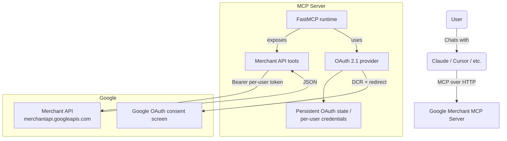

# Google Merchant Center MCP

A [Model Context Protocol](https://modelcontextprotocol.io) server that exposes
the [Google Merchant API](https://developers.google.com/merchant/api/reference/rest)
to Claude, Cursor, and any other MCP-compatible client. It mirrors the
architecture of [`mcp-google-ads`](https://github.com/cohnen/mcp-google-ads):
multi-tenant OAuth 2.1 with per-user credential storage, FastMCP scaffolding,
and a Render-ready ASGI app.

> **Why a separate server (not an extension of `mcp-google-ads`)?**
> - Different Google API host (`merchantapi.googleapis.com` vs.
>   `googleads.googleapis.com`)
> - Different OAuth scope (`auth/content` vs. `auth/adwords`)
> - No `developer-token` / `login-customer-id` headers
> - Different IDs (Merchant Center IDs / advanced accounts, not 10-digit Ads
>   customer IDs)
> - Different domain model (products, feeds, item issues, programs, reports —
>   not GAQL/campaigns)

---

## What you can ask it to do

| Tool | What it does |
|---|---|
| `list_accounts` | List every Merchant Center account the authenticated user can access |
| `list_subaccounts(account_id)` | List sub-accounts under an advanced (provider) account |
| `get_account(account_id)` | Fetch a single Merchant Center account |
| `list_users(account_id)` | List users with access to an account |
| `list_programs(account_id)` | List programs (Free Listings, Shopping Ads, …) on an account |
| `list_regions(account_id)` | List shipping regions configured for an account |
| `get_shipping_settings(account_id)` | Get shipping services + rate groups for an account |
| `get_business_info(account_id)` | Get the business address / customer-service contact |
| `list_products(account_id)` | One page of products in a Merchant Center account |
| `get_product(account_id, product_name)` | Fetch a single product by Merchant API resource name |
| `list_data_sources(account_id)` | List feeds / data sources |
| `get_data_source(account_id, data_source_id)` | Fetch one data source |
| `list_file_uploads(account_id, data_source_id)` | Show the latest upload status for a data source |
| `aggregate_product_statuses(account_id)` | Roll-up of approved / pending / disapproved counts |
| `render_account_issues(account_id)` | Localized account-level issues |
| `render_product_issues(account_id, product_name)` | Localized issues for one product |
| `run_merchant_query(account_id, query)` | Run any Merchant Reports query (the Merchant equivalent of GAQL) |
| `get_top_products(account_id, days)` | Canned "top products" report (productPerformanceView) |
| `get_price_competitiveness(account_id)` | Canned price-benchmarking report |
| `get_best_sellers(account_id, country)` | Canned best-sellers report |
| `list_promotions(account_id)` | List promotions configured on an account |
| `get_promotion(account_id, promotion_name)` | Fetch one promotion |
| `list_quotas(account_id)` | API quota usage and limits per method group |

All write endpoints (`insert` / `patch` / `delete`) are blocked by default.
Set `GOOGLE_MERCHANT_READ_ONLY=0` to allow them once you actually wire mutating
tools in.

---

## Architecture



The OAuth 2.1 flow (DCR → `/oauth2/authorize` → Google consent →
`/oauth2callback` → MCP code → `/oauth2/token` → MCP access + refresh tokens)
is identical to the Ads server. Only the **scope** (`auth/content`) and the
backing **resource server** differ.

---

## 1. Google Cloud Console setup (one-time)

1. **Enable the Merchant API** in your project: *APIs & Services → Library →
   "Merchant API" → Enable*. (Internally `merchantapi.googleapis.com`.)
2. **OAuth consent screen**:
   - User type: External (or Internal for Workspace-only)
   - Add scope `https://www.googleapis.com/auth/content`
   - Add yourself as a test user
   - Submit for verification before going to production (Google requires
     verification for the `auth/content` scope; budget 3-5 business days).
3. **OAuth 2.0 Client ID** (Web application):
   - Authorized redirect URIs:
     - `http://localhost:8000/oauth2callback` (local dev)
     - `https://<your-render-service>.onrender.com/oauth2callback` (prod)
   - Save the **Client ID** and **Client Secret**.
4. **Merchant Center access**: the Google account that authenticates must
   already have access to the target Merchant Center accounts (advanced
   account or sub-accounts). Third-party access is granted at
   <https://merchants.google.com/>.

> The Merchant API uses **only OAuth user credentials** for end users. There
> is no `developer-token`, and service accounts only work via Merchant
> Center "user" impersonation (rarely useful) — stick with OAuth.

---

## 2. Local development

```bash
git clone https://github.com/<you>/merchant-center-mcp.git
cd merchant-center-mcp
python3.11 -m venv .venv
source .venv/bin/activate
pip install -r requirements.txt
cp .env.example .env
# Fill in GOOGLE_OAUTH_CLIENT_ID / SECRET and set
#   GOOGLE_OAUTH_REDIRECT_URI=http://localhost:8000/oauth2callback
python merchant_server.py
```

Then sanity-check the OAuth metadata:

```bash
curl http://localhost:8000/.well-known/oauth-authorization-server | jq
curl http://localhost:8000/.well-known/oauth-protected-resource | jq
```

To test the full flow end-to-end, register the server in Cursor or Claude
Desktop (see §4) and let the client drive Dynamic Client Registration.

---

## 3. Render deployment

Mirrors the `mcp-google-ads` deployment shape.

### Service configuration (Web Service, Python)

| Field | Value |
|---|---|
| Runtime | Python 3.11 |
| Build Command | `pip install -r requirements.txt` |
| Start Command | `uvicorn merchant_server:app --host 0.0.0.0 --port $PORT` |
| Health Check Path | `/.well-known/oauth-protected-resource` |

### Environment variables

Set everything from `.env.example` except `PORT` (Render injects it).
Critical ones:

- `MCP_ENABLE_OAUTH21=true`
- `GOOGLE_OAUTH_CLIENT_ID`, `GOOGLE_OAUTH_CLIENT_SECRET`
- `GOOGLE_OAUTH_REDIRECT_URI=https://<service>.onrender.com/oauth2callback`
- `MERCHANT_MCP_EXTERNAL_URL=https://<service>.onrender.com`
- `GOOGLE_MCP_CREDENTIALS_DIR=/data/credentials`

### Persistent disk (required for multi-user OAuth)

Without a disk, every Render redeploy invalidates user logins (the on-disk
credential store and MCP OAuth state file vanish).

- Add a Persistent Disk: name `data`, mount path `/data`, size `1 GB`.
- Confirm `GOOGLE_MCP_CREDENTIALS_DIR=/data/credentials`.
- The provider auto-creates `/data/credentials/<email>.json` and
  `/data/credentials/mcp_oauth/server_state.json`.

### Declarative `render.yaml`

A minimal one is included in this repo. Adjust `region` / `plan` to taste,
then keep secrets in the dashboard (`sync: false`).

### Update the Google OAuth client

Add the Render URL to the OAuth client's **Authorized redirect URIs**:

```
https://<service>.onrender.com/oauth2callback
```

Without this Google rejects the redirect and consent fails.

---

## 4. Wiring it up to MCP clients

### Remote HTTP (Claude Desktop / Cursor)

```json
{
  "mcpServers": {
    "googleMerchantServer": {
      "type": "http",
      "url": "https://<service>.onrender.com/mcp"
    }
  }
}
```

The client performs Dynamic Client Registration against `/oauth2/register`,
redirects the user through Google for consent, and stores the resulting
MCP-issued token. The user's Google credentials never leave the server.

### Local stdio (single-user dev)

```json
{
  "mcpServers": {
    "googleMerchantServer": {
      "command": "/abs/path/.venv/bin/python",
      "args": ["/abs/path/merchant_server.py"],
      "env": {
        "MCP_ENABLE_OAUTH21": "false",
        "GOOGLE_MERCHANT_AUTH_TYPE": "oauth",
        "GOOGLE_OAUTH_CLIENT_ID": "...",
        "GOOGLE_OAUTH_CLIENT_SECRET": "...",
        "GOOGLE_MERCHANT_REFRESH_TOKEN": "...",
        "GOOGLE_MERCHANT_READ_ONLY": "1"
      }
    }
  }
}
```

Generate a refresh token once with the `InstalledAppFlow` (or any
out-of-band OAuth helper) so subsequent runs are headless.

---

## 5. Validation checklist

- [ ] `pip install -r requirements.txt` clean
- [ ] `python merchant_server.py` boots locally with no exceptions
- [ ] `GET /.well-known/oauth-authorization-server` returns RFC 8414 metadata
- [ ] `GET /.well-known/oauth-protected-resource` returns the resource metadata pointing at the same base URL
- [ ] The `registration_endpoint` from the metadata above accepts `POST` with an empty JSON body and returns a registered client (FastMCP defaults this to `<base>/register`)
- [ ] DCR + auth flow with Cursor lands on Google's consent screen showing **only** the `auth/content` + `openid email profile` scopes (no `adwords` scope)
- [ ] After consent, `list_accounts` returns the user's Merchant Center accounts
- [ ] `run_merchant_query(account_id, "SELECT product_view.id, product_view.title FROM productView LIMIT 5")` returns rows
- [ ] Redeploying on Render does **not** force re-login (verify `/data/credentials/mcp_oauth/server_state.json` is restored)
- [ ] Calling any future write tool with `GOOGLE_MERCHANT_READ_ONLY=1` returns `PermissionError`
- [ ] Two different Google accounts using the same MCP server see different `list_accounts` results

---

## 6. Environment variables

See `.env.example` for the full list. The most important ones:

| Variable | Purpose |
|---|---|
| `MCP_ENABLE_OAUTH21` | `true` to enable the multi-user OAuth 2.1 flow |
| `GOOGLE_OAUTH_CLIENT_ID` / `GOOGLE_OAUTH_CLIENT_SECRET` | The Google Cloud OAuth client used to talk to Google |
| `GOOGLE_OAUTH_REDIRECT_URI` | The Google-registered redirect URI (`<base>/oauth2callback`) |
| `MERCHANT_MCP_EXTERNAL_URL` | Public URL of this server (used in OAuth metadata behind Render's proxy) |
| `GOOGLE_MCP_CREDENTIALS_DIR` | Where per-user JSON credential files live (`/data/credentials` on Render) |
| `MCP_OAUTH_STATE_PERSIST` | `true` to persist DCR clients + MCP tokens across restarts |
| `MCP_ACCESS_TOKEN_TTL_SECONDS` | TTL for MCP-issued access tokens (default 3600) |
| `MCP_REFRESH_TOKEN_TTL_SECONDS` | TTL for MCP-issued refresh tokens (default 30 days) |
| `GOOGLE_MERCHANT_READ_ONLY` | `1` (default) blocks every non-`:search` / non-`:render*` write |
| `DEFAULT_MERCHANT_ACCOUNT_ID` | Optional default so callers can omit `account_id` |
| `MCP_HTTP_PATH` | Path the streamable HTTP transport is served at (default `/mcp`) |
| `MCP_BEARER_TOKEN` | Single-secret transport guard, only used when OAuth 2.1 is **off** |

You can override any sub-API version (e.g. promote one to `v1`) via:

```
MERCHANT_ACCOUNTS_API_VERSION
MERCHANT_PRODUCTS_API_VERSION
MERCHANT_DATASOURCES_API_VERSION
MERCHANT_ISSUERESOLUTION_API_VERSION
MERCHANT_REPORTS_API_VERSION
MERCHANT_PROMOTIONS_API_VERSION
MERCHANT_QUOTA_API_VERSION
```

---

## 7. Merchant Reports DSL

The Reports sub-API speaks **Merchant Reports Query Language**, a SQL-flavored
DSL that's distinct from GAQL but conceptually similar. Tables include:

- `productPerformanceView` – clicks / impressions / conversions per product
- `nonProductPerformanceView` – performance unattributed to a single product
- `productView` – product catalog snapshot (title, brand, price, item issues)
- `priceCompetitivenessProductView` – price benchmarks vs. competitors
- `priceInsightsProductView` – suggested price + projected uplift
- `bestSellersProductClusterView` – best-selling product clusters
- `bestSellersBrandView` – best-selling brands
- `competitiveVisibilityCompetitorView` – relative impression share vs. top competitors

Use `run_merchant_query` for arbitrary queries, or the canned wrappers
(`get_top_products`, `get_price_competitiveness`, `get_best_sellers`) for
common shapes. The MCP server also exposes a reference resource at
`merchant-reports://reference` and a help prompt called
`merchant_reports_help`.

---

## 8. Useful references

- API root: `https://merchantapi.googleapis.com`
- Reference index: <https://developers.google.com/merchant/api/reference/rest>
- Reports search method:
  <https://developers.google.com/merchant/api/reference/rest/reports_v1beta/accounts.reports>
- OAuth scope and access guide:
  <https://developers.google.com/merchant/api/guides/authorization/access-client-accounts>
- Reports DSL overview:
  <https://developers.google.com/merchant/api/guides/reports/overview>

---

## License

MIT.
